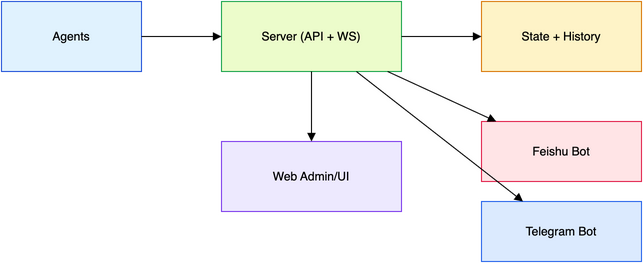

# CyberMonitor

CyberMonitor 是一款极简美观的服务器探针监控系统，采用 Go 驱动，支持多平台部署。

## Docker 部署

### 1. 创建数据目录
```bash
mkdir -p ./data
```

### 2. 运行 Server
```bash
docker run -d \
  -p 25012:25012 \
  -v "$(pwd)/data:/data" \
  --name cyber-monitor-server \
  --restart=always \
  ghcr.io/crazy0x70/cyber-monitor-server:latest
```

查看初始化信息（管理后台路径、账号、密码、Token）：
```bash
docker logs cyber-monitor-server
```

### 3. 运行 Agent
```bash
docker run -d \
  --name cyber-monitor-agent \
  --restart=always \
  --network host \
  -e CM_SERVER_URL=http://<your_server_ip>:25012 \
  -e CM_AGENT_TOKEN=<your_token> \
  -v /:/host:ro \
  -v /proc:/host/proc:ro \
  -v /sys:/host/sys:ro \
  -v /etc:/host/etc:ro \
  ghcr.io/crazy0x70/cyber-monitor-agent:latest
```

### 4. 访问地址
- 监控首页：`http://<server-host>:25012/`
- 管理后台：`http://<server-host>:25012/<admin_path>`

## Systemd 一键脚本

适用于使用 systemd 的发行版（需 root），脚本会自动创建 `/opt/CyberMonitor/`。

安装：
```bash
bash -c "$(curl -L https://raw.githubusercontent.com/crazy0x70/CyberMonitor/main/one-click.sh)" @ install
```

卸载：
```bash
bash -c "$(curl -L https://raw.githubusercontent.com/crazy0x70/CyberMonitor/main/one-click.sh)" @ remove
```

## 二进制部署

从 Releases 下载对应平台的 Server/Agent 二进制：
https://github.com/crazy0x70/CyberMonitor/releases

### Server 示例
```bash
./cyber-monitor-server -listen 25012 --data-dir ./data
```

重置管理员密码：
```bash
sudo /opt/CyberMonitor/cyber-monitor-server --reset-password
```

### Agent 示例
```bash
./cyber-monitor-agent --server-url http://<your_server_ip>:25012 --agent-token <your_token>
```

## 快速安装 Agent

### Linux / macOS
```bash
curl -fsSL https://raw.githubusercontent.com/crazy0x70/CyberMonitor/main/agent.sh -o /tmp/agent.sh && bash /tmp/agent.sh --server-url http://<your_server_ip>:25012 --agent-token <your_token>
```

### Windows
```powershell
powershell -ExecutionPolicy Bypass -Command 'iwr -UseBasicParsing https://raw.githubusercontent.com/crazy0x70/CyberMonitor/main/agent.ps1 -OutFile "$env:TEMP\\agent.ps1"; & "$env:TEMP\\agent.ps1" -ServerUrl "http://<your_server_ip>:25012" -AgentToken "<your_token>"'
```

### Windows 卸载 Agent
```powershell
powershell -ExecutionPolicy Bypass -Command 'iwr -UseBasicParsing https://raw.githubusercontent.com/crazy0x70/CyberMonitor/main/agent-uninstall.ps1 -OutFile "$env:TEMP\\agent-uninstall.ps1"; & "$env:TEMP\\agent-uninstall.ps1"'
```

## 常用环境变量

### Server
- `CM_LISTEN`：监听地址，默认 `25012`
- `CM_DATA_DIR`：数据目录，默认 `/opt/CyberMonitor/data`

### Agent
- `CM_SERVER_URL`：Server 地址
- `CM_AGENT_TOKEN`：与 Server 一致
- `CM_NET_IFACE`：指定采集网卡（逗号分隔）
- `CM_HOST_ROOT`：宿主机挂载根目录（容器部署时使用）
- `CM_INTERVAL`：采样间隔

## 管理后台

- 服务器管理支持设置显示昵称、地域、硬盘/网速、分组标签、到期与续费信息
- 离线告警在服务器管理内逐台配置，保存后下发到 Agent
- 刷新按钮会提示刷新成功，便于确认加载状态
- 「API提供商」用于配置 AI 运维能力，支持 OpenAI / Gemini / Volcengine 以及多个 OpenAI 兼容服务商
- API 提供商卡片点击展开设置，可测试连接并获取可用模型列表

## AI 运维

- 在「API提供商」配置 API Key、Base URL 与模型，可测试连接并获取可用模型
- `/ai` 会基于当前服务器状态与分组标签生成运维回答
- 通知告警中可指定 /ai 使用的提供商与 Prompt

## 通知告警

管理后台「通知告警」支持飞书 Webhook 与 Telegram Bot。

### Telegram 配置
- 需要同时填写 `Bot Token` 与 `Telegram 用户 ID`（多个用户用逗号分隔）
- 配置完成后可通过 Telegram 获取告警与服务器信息
- 离线告警开关请在「服务器管理」为每台服务器单独设置

### Telegram 命令
- `/cmall`：查看所有服务器统计
- `/server`：查看服务器列表（在线/离线分组）
- `/status <服务器ID>`：查看指定服务器状态
- `/alarmson <服务器ID>`：开启该服务器告警
- `/alarmsoff <服务器ID>`：关闭该服务器告警
- `/ai <问题>`：AI 运维查询（例如：/ai 哪台服务器下载量最多）

## 架构图


