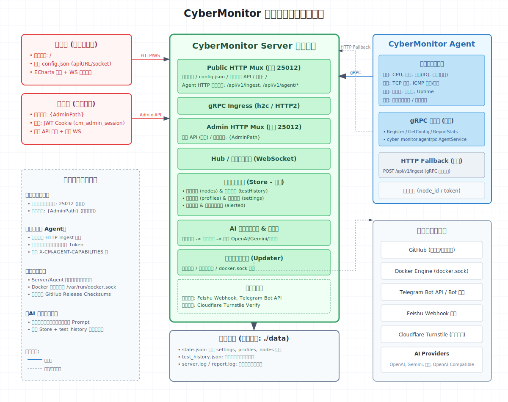
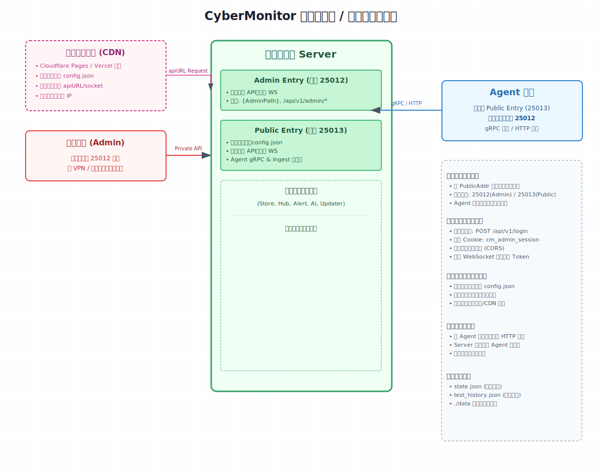

<div align="center">
  <h1>CyberMonitor</h1>
  <p>极简、美观、轻量级的自托管服务器探针与监控系统</p>

  <p>
    <a href="https://github.com/crazy0x70/CyberMonitor/blob/main/LICENSE"></a>
    
    
  </p>
</div>


## 🚀 快速上手

### 1. 一键安装 (推荐)
自动配置 systemd 服务（按提示可选择安装主控 Server 或探针 Agent）：
```bash
bash -c "$(curl -L https://raw.githubusercontent.com/crazy0x70/CyberMonitor/main/one-click.sh)" @ install
```

### 2. Docker 部署主控
```bash
mkdir -p ./data
docker run -d -p 25012:25012 -e CM_DATA_DIR=/data -v "$(pwd)/data:/data" --name cyber-monitor-server --restart=always ghcr.io/crazy0x70/cyber-monitor-server:latest
```
*(部署后，通过 `docker logs cyber-monitor-server` 获取初始后台路径与 Agent Token)*

如果你希望 **管理后台支持一键更新 Docker 版服务端**，请额外挂载：

```bash
-v /var/run/docker.sock:/var/run/docker.sock
```

完整示例：

```bash
mkdir -p ./data
docker run -d \
  -p 25012:25012 \
  -e CM_DATA_DIR=/data \
  -v "$(pwd)/data:/data" \
  -v /var/run/docker.sock:/var/run/docker.sock \
  --name cyber-monitor-server \
  --restart=always \
  ghcr.io/crazy0x70/cyber-monitor-server:latest
```

启用后，后台的“立即更新”会改为调用宿主机 Docker API 执行：
- 拉取目标镜像
- 保留原容器的环境变量、卷挂载、网络和重启策略
- 重建容器并拉起新版本

注意：挂载 `docker.sock` 等于把宿主机 Docker 控制权授予容器，请仅在可信环境启用。

### 3. Docker 部署探针 (Agent)
```bash
docker run -d \
  --name cyber-monitor-agent \
  --network host \
  --restart always \
  --cap-add NET_RAW \
  -e CM_SERVER_URL="http://<主控IP>:25012" \
  -e CM_AGENT_TOKEN="<你的Token>" \
  -e CM_NODE_ID="my-node-id" \
  -v /:/host:ro \
  -v /proc:/host/proc:ro \
  -v /sys:/host/sys:ro \
  -v /etc:/host/etc:ro \
  ghcr.io/crazy0x70/cyber-monitor-agent:latest
```

说明：

- `CM_SERVER_URL` 是 Agent 的统一接入地址，不需要额外再配置一个单独的 gRPC 地址
- 新版 Agent 会先尝试在这个地址上建立 `gRPC` 控制链路
- 如果你的反代、隧道、CDN 或中间层只支持 `HTTP/1.1`，Agent 会自动回退到现有 `HTTP` 链路
- 如果你希望 Agent 真正长期工作在 `gRPC` 优先模式，建议让 Agent 直连 Server，或使用支持 `HTTP/2` / `h2c` 的反向代理

如果你希望 **管理后台支持一键更新 Docker 版 Agent**，则每个 Agent 容器也需要额外挂载：

```bash
-v /var/run/docker.sock:/var/run/docker.sock
```

完整示例：

```bash
docker run -d \
  --name cyber-monitor-agent \
  --network host \
  --restart always \
  --cap-add NET_RAW \
  -e CM_SERVER_URL="http://<主控IP>:25012" \
  -e CM_AGENT_TOKEN="<你的Token>" \
  -e CM_NODE_ID="my-node-id" \
  -v /:/host:ro \
  -v /proc:/host/proc:ro \
  -v /sys:/host/sys:ro \
  -v /etc:/host/etc:ro \
  -v /var/run/docker.sock:/var/run/docker.sock \
  ghcr.io/crazy0x70/cyber-monitor-agent:latest
```

这样服务端下发“立即更新”后，Agent 会在本机调用 Docker API：
- 拉取对应版本的新镜像
- 复用当前容器配置创建替换容器
- 停掉旧容器并启动新容器

建议 Docker 部署时始终显式指定 `CM_NODE_ID`。这样容器重建、迁移宿主机或回滚镜像后，服务端仍会把它识别为原来的同一台节点，而不是新增一台随机节点。

兼容旧版 Docker 环境变量写法：
- 当前版本优先推荐使用 `CM_SERVER_URL`、`CM_AGENT_TOKEN`、`CM_NODE_ID`
- 也兼容旧写法 `server-url`、`agent-token`、`node-id`
- 例如你之前使用的 `-e node-id=existing-node-01`，现在也会被正确识别

如果该 Agent 需要拒绝后台下发的远程更新任务，可额外追加：

```bash
-e CM_DISABLE_UPDATE=1
```

这会让节点继续正常上报监控数据，但后台会把它识别为“已禁用远程更新”的节点。

### 4. 安装探针 (Agent)
`Node ID` 现在默认会在首次安装时随机生成，并持久化到本地；如果你希望和现有资产命名、自动化编排或迁移策略对齐，也可以在安装时显式指定。

说明：

- 安装命令里的 `--server-url` / `-ServerUrl` 仍然只需要填写一个统一入口
- 安装阶段注册使用 `HTTP` 完成首个 bootstrap 握手
- 安装完成后的 Agent 运行态会优先尝试 `gRPC`，不可用时自动回退 `HTTP`
- 如果你填的是 `https://` 地址，请确保前置反代到服务端时尽量保留 `HTTP/2`；否则 Agent 仍可工作，但会自动回退到 `HTTP`

**Linux / macOS**
```bash
curl -fsSL https://raw.githubusercontent.com/crazy0x70/CyberMonitor/main/agent.sh -o /tmp/agent.sh && bash /tmp/agent.sh --server-url http://<主控IP>:25012 --agent-token <你的Token>
```
**Windows**
```powershell
$script = Join-Path $env:TEMP 'agent.ps1'
Invoke-WebRequest -UseBasicParsing 'https://raw.githubusercontent.com/crazy0x70/CyberMonitor/main/agent.ps1' -OutFile $script
& $script -ServerUrl 'http://<主控IP>:25012' -AgentToken '<你的Token>'
```

如果需要手动指定 `Node ID`：

**Linux / macOS**
```bash
curl -fsSL https://raw.githubusercontent.com/crazy0x70/CyberMonitor/main/agent.sh -o /tmp/agent.sh && bash /tmp/agent.sh --server-url http://<主控IP>:25012 --agent-token <你的Token> --node-id my-node-id
```

**Windows**
```powershell
$script = Join-Path $env:TEMP 'agent.ps1'
Invoke-WebRequest -UseBasicParsing 'https://raw.githubusercontent.com/crazy0x70/CyberMonitor/main/agent.ps1' -OutFile $script
& $script -ServerUrl 'http://<主控IP>:25012' -AgentToken '<你的Token>' -NodeId 'my-node-id'
```

如果你希望该节点拒绝服务端下发的远程更新，可以在部署时显式追加 `disable-update`：

**Linux / macOS**
```bash
curl -fsSL https://raw.githubusercontent.com/crazy0x70/CyberMonitor/main/agent.sh -o /tmp/agent.sh && bash /tmp/agent.sh --server-url http://<主控IP>:25012 --agent-token <你的Token> --disable-update
```

**Windows**
```powershell
$script = Join-Path $env:TEMP 'agent.ps1'
Invoke-WebRequest -UseBasicParsing 'https://raw.githubusercontent.com/crazy0x70/CyberMonitor/main/agent.ps1' -OutFile $script
& $script -ServerUrl 'http://<主控IP>:25012' -AgentToken '<你的Token>' -DisableUpdate
```

手工运行二进制时，也可以使用：

```bash
./cyber-monitor-agent --server-url http://<主控IP>:25012 --agent-token <你的Token> --disable-update
```

或环境变量：

```bash
CM_DISABLE_UPDATE=1 ./cyber-monitor-agent --server-url http://<主控IP>:25012 --agent-token <你的Token>
```

注意：

- **未挂载 `docker.sock` 的 Docker Agent** 仍然不会执行后台一键更新，后台会提示你手动拉取新镜像并重建容器。
- **挂载了 `docker.sock` 的 Docker Agent** 才能执行后台一键更新。
- 如果你还希望该容器明确拒绝服务端更新任务，可同时追加 `--disable-update` 或设置 `CM_DISABLE_UPDATE=1`。
- 如果你当前运行的是不包含这套 Docker 编排更新能力的旧版本镜像，那么首次切换到本版本前，仍需要先手动升级一次；升级到这一版之后，后续才能在后台直接点击更新。

## 🔄 服务端升级后，旧版 Agent 如何处理

从 `v0.3.8` 版本开始，服务端会为每个节点维护独立的 `Agent Token`。这意味着：

- 新版 Agent 会优先使用“节点专属 token”与服务端通信
- 旧版 Agent 仍可能只持有“全局 bootstrap token”

为了避免服务端升级后必须批量重建 Agent，当前版本已经做了兼容处理：

- 旧版 Agent 继续使用 bootstrap token 上报时，服务端仍允许其上报
- 旧版 Agent 首次访问 `/api/v1/ingest` 或 `/api/v1/agent/config` 时，服务端会自动为该 `Node ID` 补发并持久化节点专属 token
- 如果旧版 Agent 支持后续远程升级，那么它可以在不重建的前提下继续工作并逐步切换到新版模式
- 旧版 Agent 继续走原有 `HTTP` 链路即可；新版 Agent 则会优先尝试 `gRPC`
- 旧版 GitHub Agent 的 `/api/v1/agent/config` 严格按旧 JSON schema 解析；当前服务端已对这类旧 Agent 保持兼容，不会因为新增 `agent_token` / `update` 字段而导致配置拉取报错

### 场景 1：旧版 Agent 还在运行

通常**不需要重建**。

只要旧版 Agent 还能连上服务端，它就可以继续上报；服务端会兼容旧 token，并自动为该节点补齐专属凭据。

### 场景 2：Docker Agent 已经重建或需要重新创建容器

这时最关键的不是“重新注册”，而是**继续使用原来的 `Node ID`**。

正确做法：

```bash
docker run -d \
  --name cyber-monitor-agent \
  --network host \
  --restart always \
  --cap-add NET_RAW \
  -e CM_SERVER_URL="http://<主控IP>:25012" \
  -e CM_AGENT_TOKEN="<你的Token>" \
  -e CM_NODE_ID="existing-node-01" \
  -v /:/host:ro \
  -v /proc:/host/proc:ro \
  -v /sys:/host/sys:ro \
  -v /etc:/host/etc:ro \
  ghcr.io/crazy0x70/cyber-monitor-agent:latest
```

如果你沿用的是旧脚本或旧编排，也可以继续写：

```bash
-e server-url="http://<主控IP>:25012"
-e agent-token="<你的Token>"
-e node-id="existing-node-01"
```

当前版本同样兼容。

### 场景 3：我想保留“原节点”而不是生成一台新节点

只需要满足这一条：

- 重建后的 Agent 使用和旧节点完全相同的 `Node ID`

如果 `Node ID` 变了，服务端就会把它视为一台新的节点；如果 `Node ID` 不变，服务端会继续沿用原节点资料、分组、标签和更新状态。

### 场景 4：什么时候才需要真正“重建 Agent”

只有在这些情况下才建议重建：

- 旧 Agent 已经彻底丢失，无法启动
- 旧容器没有保留原 `Node ID`，且你也不清楚以前用的节点标识
- 旧版二进制损坏，无法继续上报，也无法接受后续升级

即便需要重建，也建议优先保留原 `Node ID`，这样服务端仍会把它识别为原节点。

### 5. 卸载探针 (Agent)
**Linux / macOS**
```bash
curl -fsSL https://raw.githubusercontent.com/crazy0x70/CyberMonitor/main/agent-uninstall.sh -o /tmp/agent-uninstall.sh && sudo bash /tmp/agent-uninstall.sh
```

**Windows**
```powershell
$script = Join-Path $env:TEMP 'agent-uninstall.ps1'
Invoke-WebRequest -UseBasicParsing 'https://raw.githubusercontent.com/crazy0x70/CyberMonitor/main/agent-uninstall.ps1' -OutFile $script
& $script
```

Unix 卸载脚本会清理以下内容：
- `cyber-monitor-agent` 服务
- `INSTALL_DIR` 默认路径 `/opt/CyberMonitor` 下的 Agent 二进制
- `CONF_DIR` 默认路径 `/etc/cybermonitor/agent.conf`

其中 Linux 会移除 `systemd` 服务文件；macOS 会尝试移除常见的 `launchd plist` 安装项。

## 📖 灵活部署与架构拓扑

CyberMonitor 采用 `Agent 采集 -> Server 聚合 -> HTTP + WebSocket 展示` 的标准架构，支持两种典型部署模式：

- `Agent -> Server`：新版 Agent 默认优先走 `gRPC`，失败后自动回退到 `HTTP`
- `Browser -> Server`：前台展示页与管理后台继续使用 `HTTP + WebSocket`

### 1. 直接部署（一体化架构）
默认 `25012` 端口同时负责前台展示、后台管理与 Agent 上报，配置最简单，适合绝大多数自托管场景。



### 2. 前后端分离部署（硬隔离架构）
如果你希望将前台状态页完全公开，但不暴露管理后台，可以使用 `CM_PUBLIC_LISTEN` 环境变量（例如设为 `25013`）分离展示接口与管理端口。

同时，你可以提取前端静态文件（位于 `internal/server/web/` 下），将其纯静态化托管至 Cloudflare Pages / Vercel 等 CDN 服务，隐藏真实后端 IP。



### 3. Agent 与 Server 通信协议：gRPC 优先，HTTP 自动回退

从当前版本开始，Agent 控制面协议行为如下：

- 同一个 `CM_SERVER_URL` / `--server-url` 会被同时用于 `gRPC` 优先探测和 `HTTP` 回退
- 新版 Agent 会优先尝试 `gRPC`
- 如果目标环境不支持 `HTTP/2` / `h2c`，或中间层主动降级为 `HTTP/1.1`，Agent 会自动回退到现有 `HTTP` 链路
- 旧版 Agent 不需要为此重建，它本身继续走原有 `HTTP` 上报即可
- 前台展示页与管理后台的 WebSocket / HTTP 链路不受这次 Agent 协议升级影响

### 4. 反向代理与 HTTPS 部署注意事项

- 如果你希望 Agent 真正工作在 `gRPC` 优先模式，建议让 Agent 直连 Server，或使用支持 `HTTP/2` / `h2c` 透传的反向代理
- 如果前置代理只支持 `HTTP/1.1`，这不属于故障；Agent 仍可正常运行，只是会自动回退到 `HTTP`
- `config.json` 只控制浏览器访问的 `Public API / WebSocket`，并不等同于 Agent 的控制面入口
- 在分离部署下，Agent 应连接服务端公开给 Agent 的入口；该入口会同时承载 `Agent gRPC` 与 `Agent HTTP`

**CDN 节点静态配置示例 (`config.json`)**
部署到静态托管服务时，只需在静态文件根目录新建一个 `config.json` 指定后端接口：
```json
{
  "socket": "wss://api.example.com:25013/ws",
  "apiURL": "https://api.example.com:25013"
}
```

---

<div align="center">
  如果 CyberMonitor 对你有帮助，欢迎点亮 ⭐️ <b>Star</b> 予以支持！
</div>
